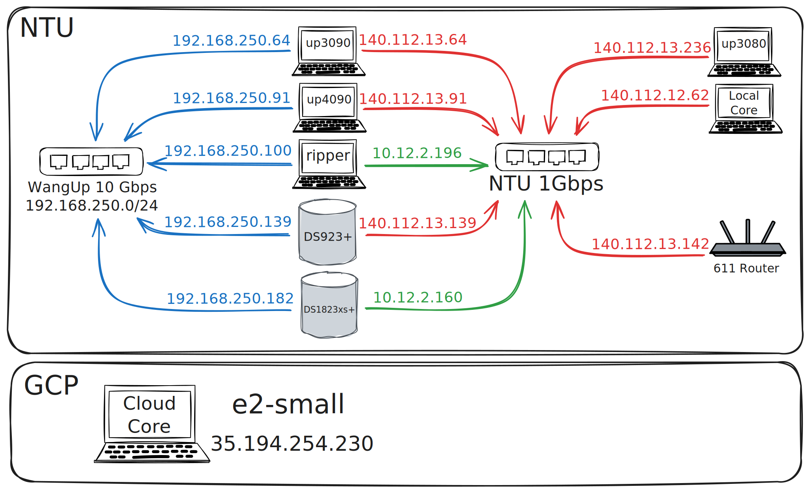

# Specification

## Server Specifications

The lab has 3 GPU servers and 1 CPU server. Suitable for interactive work, initial experiments, and moderate computation. For large-scale training, see [HPC Tutorial](../../hpc/overview.md).

| Server | CPU | GPU | RAM | External IP | Internal IP |
|--------|-----|-----|-----|-------------|-------------|
| **up3080** i7 + RTX 3080 Ti | Intel i7-11700 | NVIDIA RTX 3080 Ti | 126GB | 140.112.13.236 | - |
| **up4090** i7 + RTX 4090 | Intel i7-12700 | NVIDIA RTX 4090 | 126GB | 140.112.13.91 | 192.168.250.91 |
| **up3090** 5950 + RTX 3090 | AMD Ryzen 9 5950X | NVIDIA RTX 3090 | 78.5GB | 140.112.13.64 | 192.168.250.64 |
| **ripper** Threadripper | AMD Threadripper 7965WX | - | 256GB (8-channel) | - | 192.168.250.100 |

### GPU Capabilities

| Model | VRAM | CUDA Cores | Best Use Case |
|-------|------|------------|---------------|
| RTX 4090 | 24GB | 16,384 | Largest models, fastest training |
| RTX 3090 | 24GB | 10,496 | Large models, good performance |
| RTX 3080 Ti | 12GB | 10,240 | Medium models, testing |

---

## Storage Specifications

All storage is NAS-mounted via NFS on every compute node.

### DS923+ (83.7TB)

| | |
|-|-|
| **External IP** | 140.112.12.139 |
| **Internal IP** | 192.168.250.139 |
| **Shares** | `homes` → `/home/NAS/homes` (legacy), `data` → `/home/NAS/data` |

### DS1823xs+ (35TB)

| | |
|-|-|
| **Internal IP** | 192.168.250.182 |
| **Shares** | `homes` → `/home/NAS/house` (primary user home) |

---

## Network Topology

