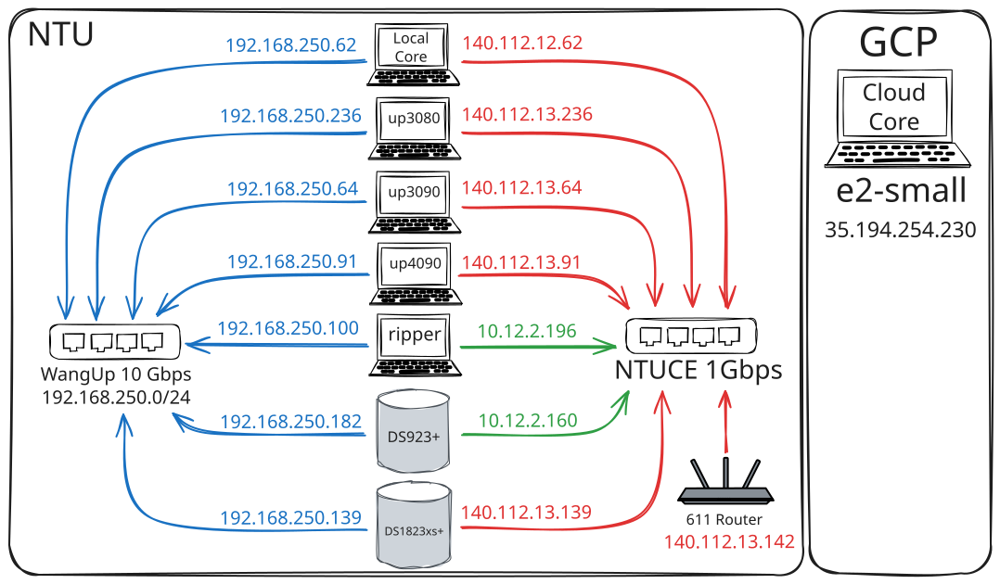

# Specification

## Compute Servers

Three GPU servers and one CPU server — for interactive work, experiments, and moderate compute. For large-scale training, see [HPC](../hpc/overview.md).

| Server | CPU | GPU | RAM | Public IP | Internal IP | NAS link |
|--------|-----|-----|-----|-----------|-------------|----------|
| **`up3080`** | Intel i7-11700 | RTX 3080 Ti (12 GB) | 126 GB | 140.112.13.236 | — | 1 GbE |
| **`up3090`** | AMD Ryzen 9 5950X | RTX 3090 (24 GB) | 78.5 GB | 140.112.13.64 | 192.168.250.64 | 10 GbE |
| **`up4090`** | Intel i7-12700 | RTX 4090 (24 GB) | 126 GB | 140.112.13.91 | 192.168.250.91 | 10 GbE |
| **`ripper`** | AMD Threadripper 7965WX | — | 256 GB (8-channel) | — | 192.168.250.100 | 10 GbE |

Each server has a **2 TB local SSD**, ~1.5 TB allocated to local home (`/home/<user>`, shared by users on that machine).

### GPU Capabilities

| Model | VRAM | CUDA Cores | Best for |
|-------|------|------------|----------|
| RTX 4090 | 24 GB | 16,384 | Largest models that fit, fastest iteration |
| RTX 3090 | 24 GB | 10,496 | Large models, strong all-rounder |
| RTX 3080 Ti | 12 GB | 10,240 | Medium models, testing |

---

## Storage

Two Synology NAS units, mounted via NFS on every server. Both use **RAID5** — survives a single failed disk, but is **not a backup** and takes no snapshots. See [Data Safety](../user-guide/storage/overview.md#data-safety).

| Unit | Capacity | Internal IP | Public IP | Shares (mount point) |
|------|----------|-------------|-----------|----------------------|
| DS1823xs+ (wangup26) | 35 TB | 192.168.250.182 | — | `homes` → `/home/NAS/house` (primary home) |
| DS923+ (wangup) | 83.7 TB | 192.168.250.139 | 140.112.12.139 | `homes` → `/home/NAS/homes` (legacy), `data` → `/home/NAS/data` |

For user-facing storage guidance, see [Storage Overview](../user-guide/storage/overview.md).

---

## Network Topology

- **Private 10 GbE switch** (`192.168.250.x`) connects `up3090`, `up4090`, `ripper`, and both NAS units — the fast path for NAS I/O (~600 MB/s).
- **`up3080`** is on the organization's public switch at **1 GbE**. It still reaches both NAS units over the org network (DS1823xs+ via its internal address), but NAS I/O is capped at ~110 MB/s.
