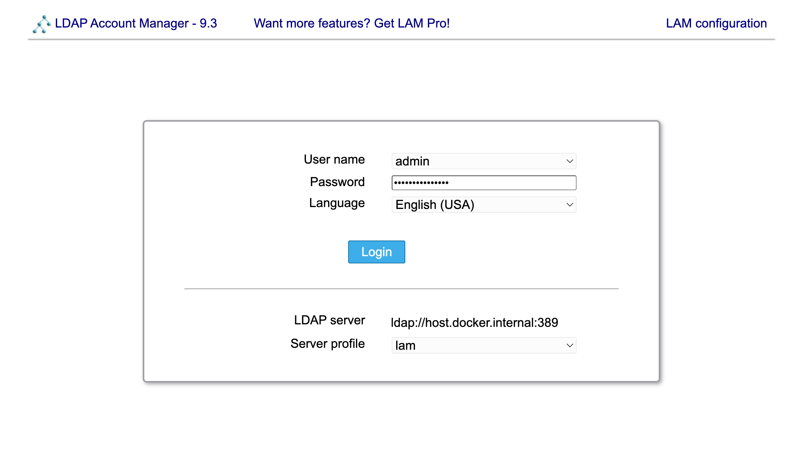
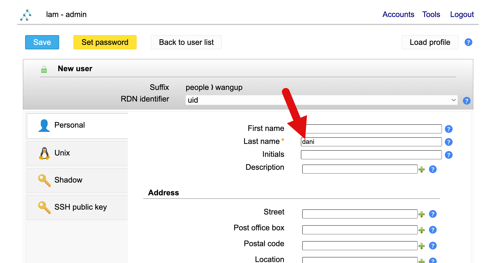
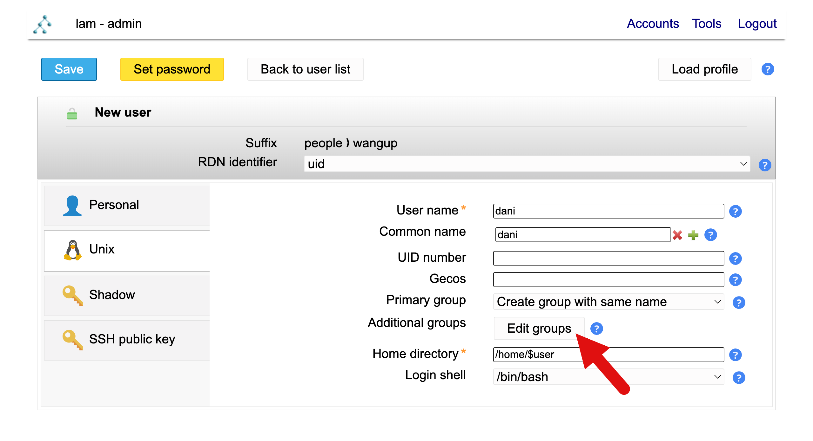
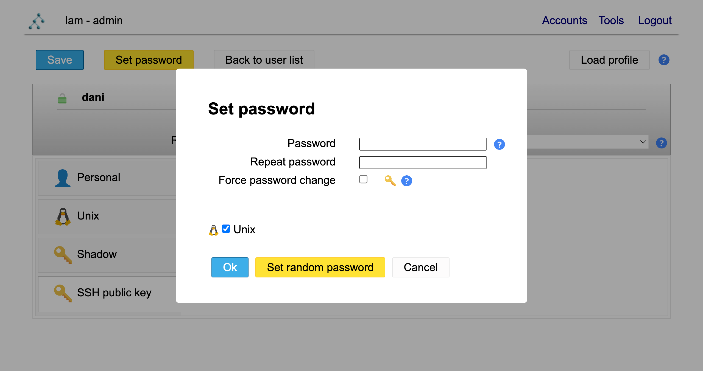

# Account management
In the account system, [OpenLDAP](https://www.openldap.org/) is the backend and [PLA](https://phpldapadmin.org/) 
is the Web front end.

## Adding new users
Login into [PLA](account.lab.wangup.org). Select the **`lam`** server profile and login as admin

Create a new user by clicking the blue **`New user`** button.

Fill in the username in the **`Last name`** input. For example **`dani`**.

In the **`Unix`** tab. Click the **`Edit groups`**.

Select the **`team`** group on the left panel and click the **`<-`** arrow.
The **`team`** will appear on the left panel after this.

Go to **`SSH public key`** tab and click **`Add SSH public key extension`**.

Click the yellow **`Set password`** button and input the password.

Finally, clidk the blue **`Save`** button to finish adding new user.
You should be able to see `LDAP operation successful` on the page.


## NAS configuration
To make user able to access NAS when they ssh into a **[Podman]**(https://podman.io/) container. We need to explicitly set the individual user permission to read NAS.

First, login to NAS as **`wangupad`**. Go to **`Control Panel`** > **`Domain/LDAP`** >
 **`LDAP user`** > Double click the new user > **`Permission`**. Then enable the **`Read Only`** permission on **`Data`** and **`homes`**.

!!! note
    User's permission on those two folder might already be **`Read Only`** before access granted per user.
    It's because the group **`team`** also grant permission to those two folder. However, when user ssh into
    a rootless podman container. Their group crdentials are not inherited. So per user permission access still 
    need to be granted for ssh into a container.

## Server configuration
### subuid/subgid for Podman
User need to be granted access to a range of subuid/subgid. This require manual setting up in
 `/etc/subgid` and `/etc/subuid`. We do this using a script. Please execute this script to setup subuid/subgid.

```apacheconf linenums="1" title="Generate subuid/subgid"
sudo rm -rf
ls -lah
```
