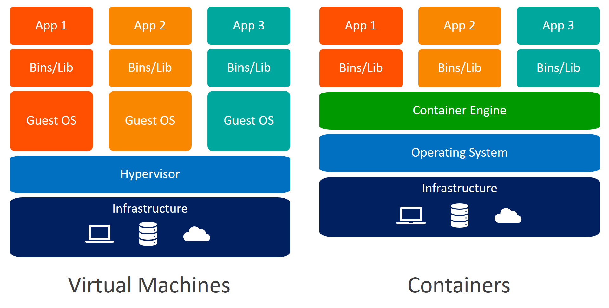
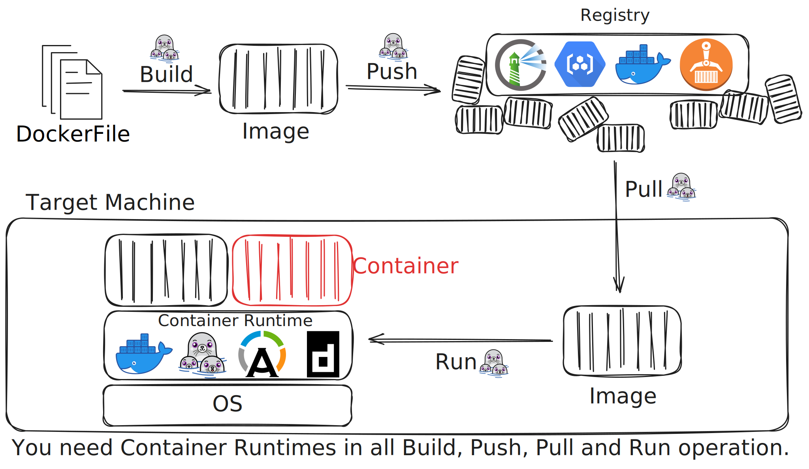

# Introduction to Containers

Containers let you run an isolated environment with its own OS, tools, and dependencies — without affecting the host system. On our servers, this is also how you get root access.

## What Are Containers?

Containers are lightweight, portable packages that include your application and all its dependencies. Think of them as a complete computing environment that you can run anywhere.



## Why Containers Matter for Research

### 1. Reproducibility

Installed something wrong? The container is disposable — throw it away and start fresh in seconds. Your files are safe on NAS.

=== "podman"

    ```bash linenums="1"
    podman rm -f mycontainer
    podman run -d --name mycontainer ...
    ```

    See [podman run documentation](https://docs.podman.io/en/latest/markdown/podman-run.1.html).

=== "podman compose"

    ```bash linenums="1"
    podman compose down
    podman compose up -d
    ```

    See [podman compose documentation](https://docs.podman.io/en/latest/markdown/podman-compose.1.html).

The new container is identical to the original image — no trace of whatever you broke.

### 2. Portability & Dependency Management

Build your environment once, run it anywhere. Hand the image to a labmate — they 
pull it and get the exact same setup with no configuration on their end. 
Each project lives in its own container, so conflicting dependencies between 
projects are never a problem.

### 3. Isolation

Your container is completely separate from the host and from other users' 
containers. You have root access inside without affecting anyone else on the same 
machine. Install, break, and experiment freely — nothing leaks out.

## Container Concepts

### Images

An image is a read-only blueprint that defines everything inside the environment: 
OS, packages, configs, and your code. It is built from a `Dockerfile` (or `Containerfile`)
— a plain text file that describes what to install and how to set up the environment. 
Once built, an image never changes; you tag it with a version (e.g., `myenv:v1.0`) 
to track iterations. You never run an image directly — you create containers from it.

### Container Runtime

The runtime is the software on the host machine that takes an image and turns 
it into a running container. It handles the OS-level isolation that keeps 
containers separate from each other and from the host. You interact with the 
runtime through a CLI — on our servers, that's **Podman**.

### Containers

A container is a live, running instance created from an image — like booting a 
machine from a disk snapshot. It is isolated from the host and from other 
containers: what happens inside stays inside. Any changes you make (installing 
packages, editing files) exist only in that container; the source image is 
untouched. This makes containers disposable by design — delete one and recreate 
it from the same image to get a clean slate. Multiple containers can also run 
from the same image simultaneously without interfering with each other.

### Registries

A registry is a server that stores and distributes images — the equivalent of 
GitHub, but for containers. You **push** an image to share it and **pull** an 
image to use it on any machine. Images are identified by a full address: 
`registry/project/name:tag` (e.g., `harbor.lab.wangup.org/lab/base:cuda12`). 
[Docker Hub](https://hub.docker.com) is the public default; we run a private 
registry using [Harbor](harbor.md) for lab images.



## Docker vs Podman

Docker requires root. A background daemon (`dockerd`) runs as root and manages 
all containers on your behalf. Podman is daemonless — each container runs as a 
direct child process of your user, which is why it can operate rootless. The 
commands look nearly identical, so most Docker tutorials work by replacing 
`docker` with `podman`.

!!! note "Keeping containers running after logout"
    Because there is no daemon, containers don't automatically survive your 
    session. A detached container (`-d`) stops when you log out. To keep 
    containers running after logout, enable lingering for your user once:

    ```bash
    loginctl enable-linger $USER
    ```

Podman is highly compatible with Docker but not 100%. Common commands (`run`, `pull`, `push`, `build`, `exec`) behave the same. What doesn't work: Docker Swarm commands (`docker swarm`, `docker stack`) have no Podman equivalent, and `podman compose` is a separate tool that covers most but not all `docker compose` features. See [Using Podman](podman.md) for details.

## How We Use Containers in the Lab

All lab servers run rootless Podman — there is no sudo access for regular users on any machine. Containers are how you install software and manage your environment. The choice of server is purely about hardware: GPU servers for GPU-accelerated work, Threadripper for CPU-intensive tasks.

### NCHC (National Center for High-Performance Computing)

NCHC also requires containers, but uses **Singularity/Apptainer** instead of Podman. The good news: Singularity is compatible with your existing Podman images, so the environment you build in the lab runs the same way on HPC. See the [HPC Overview](../../hpc/overview.md) for how to transition.

## Our Harbor Registry

Instead of Docker Hub, we run our own private registry using Harbor at `registry.lab.wangup.org`. It hosts curated base images for common lab tasks and private project images. See [Harbor Registry](harbor.md) for usage.

---

**Next Step**: Learn about [Using Podman](podman.md)
