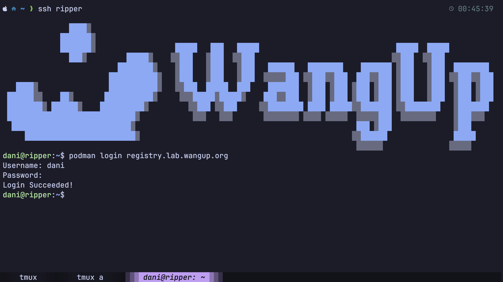

# Using Podman

All lab servers run rootless Podman. This page covers the full workflow — pulling images, running containers, getting inside them, and keeping them clean.

---

## Pulling Images

```bash linenums="1"
podman pull docker.io/ubuntu:24.04
podman pull registry.lab.wangup.org/library/devel:0.6-cuda13.1.1
podman pull nvcr.io/nvidia/pytorch:25.03-py3
```

Docker Hub is the default registry — `ubuntu:24.04` and `docker.io/ubuntu:24.04` are equivalent. For any other registry, include the full address.

**Registry login** — public Docker Hub images need no login. The lab registry and NGC do:

```bash linenums="1"
podman login registry.lab.wangup.org   # lab registry
podman login nvcr.io                   # NVIDIA NGC
```

!!! info
    The `Username` and `Password` is the same as server account



**Local image management**

| Command | What it does |
|---------|-------------|
| `podman images` | List all local images |
| `podman rmi <image>` | Remove an image |
| `podman image prune` | Remove all dangling (unused) images |

---

## Running an Image

### One-off containers

`podman run --rm -it <image> bash` drops you into a shell and the container is **deleted** on exit.

```bash linenums="1"
podman run --rm -it registry.lab.wangup.org/library/devel:0.6-cuda13.1.1 bash
```

**Common flags**

| Flag | Purpose | Example |
|------|---------|---------|
| `--rm` | Delete container on exit | one-off testing |
| `-it` | Interactive terminal | shell access |
| `--name <name>` | Naming the container for later use | `--name dev` |
| `-d` | Detached (background) | long-running container |
| `-e KEY=value` | Pass env var | `-e CUDA_VISIBLE_DEVICES=0` |
| `--env-file <file>` | Pass env vars from a file | `--env-file .env` |
| `-p host:container` | Port mapping | `-p 12345:22` for SSH |
| `-v host:container` | Volume mount | `-v $HOME:$HOME` |
| `-v host:container:ro` | Read-only mount | protecting data |
| `--device nvidia.com/gpu=all` | GPU passthrough | CUDA workloads |

### Long-running containers

A detached container stays alive after you close the terminal — provided lingering is enabled (see [Docker vs Podman](intro.md#docker-vs-podman)).

```bash linenums="1"
podman run -d --name mydev \
    --device nvidia.com/gpu=all \
    -v $HOME:$HOME \
    registry.lab.wangup.org/library/devel:0.6-cuda13.1.1
```

Stop and remove:

```bash linenums="1"
podman stop mydev     # graceful SIGTERM
podman kill mydev     # immediate SIGKILL — for stuck containers
podman rm mydev       # remove a stopped container
podman rm -f mydev    # force-remove even if running
```

### Compose files for repeatable setups

For anything you start more than once, a `compose.yml` is cleaner than typing flags. The example below is the standard lab development setup:

!!! warning "This may be outdated"
    The compose file shown here is for reference only. For the latest version and a ready-to-copy file, see the [containerfiles](https://github.com/NTU-CompHydroMet-Lab/containerfiles) repository.

--8<-- "snippets/compose-dev.md"

Lifecycle commands:

```bash linenums="1"
podman compose up -d       # start all services in the background
podman compose down        # stop and remove containers
podman compose logs -f     # tail logs from all services
```

### Checking container state

After starting a container, verify it is actually running:

```bash linenums="1"
podman ps       # running containers
podman ps -a    # all containers, including stopped
```

The `STATUS` column shows `Up X hours` for running and `Exited (N) X ago` for stopped. A non-zero exit code means the container crashed rather than stopped cleanly — `Exited (137)` means SIGKILL.

---

## Interacting with Container

### `podman exec` — fastest path in

If the container is already running, `exec` opens a shell directly — no port or SSH config needed:

```bash linenums="1"
podman exec -it example-container bash
podman exec -it example-container zsh
```

Run a one-off command without a shell:

```bash linenums="1"
podman exec example-container python --version
```

### SSH — for VSCode Remote and external clients

SSH is required for VSCode Remote-SSH and for connecting from outside the host server. Three things must be in place:

1. **sshd running in the container** — the `command:` block in the compose file handles this. The script generates host keys on first start, then reuses them on every subsequent start.
2. **Port exposed** — the `ports:` entry maps a host port to port 22. Pick an unused port in `10000–65535`.
3. **Host keys persisted** — the `container-keys` volume mount stores host keys in your home directory. Without persistence, clients see "REMOTE HOST IDENTIFICATION HAS CHANGED" after each recreate because the container generates new keys on every start.

Add an entry to `~/.ssh/config` on your **local machine**. The config differs depending on whether the server has a public IP:

=== "Server with public IP (e.g. up3080, up3090, up4090)"

    ```apacheconf linenums="1"
    Host mycontainer
        HostName <server-public-ip>
        Port 12345
        User yourname
        IdentityFile ~/.ssh/WangupServer
    ```

=== "Server without public IP (e.g. ripper)"

    ```apacheconf linenums="1"
    Host mycontainer
        HostName <server-internal-ip>
        Port 12345
        User yourname
        IdentityFile ~/.ssh/WangupServer
        ProxyJump up3090
    ```

    `ProxyJump` tunnels the connection through a public-IP server to reach the internal network. `up3090` must already be in your SSH config.

| Field | Description |
|-------|------------|
| `HostName` | The server's IP. See [Network Topology](../../infrastructures/computing-specs.md#network-topology) for public vs internal IPs. |
| `Port` | The host port from `compose.yml` |
| `User` | Your LDAP username |
| `IdentityFile` | SSH key registered with your account. See [Account Registry](../onboard/account.md#upload-your-ssh-key) to upload one. |
| `ProxyJump` | Tunnels the connection through a public-IP server to reach an internal server. Only needed when the target server has no public IP. The jump host must already be configured — see [Login into Server](../onboard/account.md#login-into-server). |

Then connect with `ssh mycontainer`. For the step-by-step first-time setup, see [Development](../onboard/development.md).

### VSCode Dev Containers

The [Dev Containers](https://marketplace.visualstudio.com/items?itemName=ms-vscode-remote.dev-containers) extension attaches VSCode to a running container using `podman exec` — no sshd and no port mapping required. Install the extension, open the Command Palette, and run **`Dev Containers: Attach to Running Container`**.

### Inside vs outside the container

| | Inside container | Outside (host) |
|--|-----------------|----------------|
| Permissions | Full root via `sudo` | Rootless (your LDAP user) |
| Filesystem | Container layer + mounted volumes | Host filesystem |
| Network | Container's own namespace | Host network |

Files in mounted volumes are shared — edits inside are visible outside and vice versa. Everything else exists only in the container layer and is gone when the container is removed.

---

## Other Important Concepts

### Following logs

```bash linenums="1"
podman logs example-container              # print all logs
podman logs -f example-container           # tail and follow
podman logs --tail 50 example-container    # last 50 lines
```

### Debugging with inspect

When something looks wrong — wrong env var, missing mount, unexpected network — `inspect` is the source of truth:

```bash linenums="1"
podman inspect example-container | jq '.[0].Mounts'
podman inspect example-container | jq '.[0].Config.Env'
```

### Cleanup

Old containers and images consume disk quota.

```bash linenums="1"
podman system prune      # remove stopped containers, dangling images, unused networks
podman system prune -a   # also remove images not used by any running container
podman volume ls         # list named volumes
podman volume prune      # remove volumes not attached to any container
```

!!! warning
    `system prune -a` removes all images not currently in use. Re-pulling large CUDA-based images (10–20 GB each) is slow and counts against bandwidth. Only run this when you are certain you won't need those images again soon.
