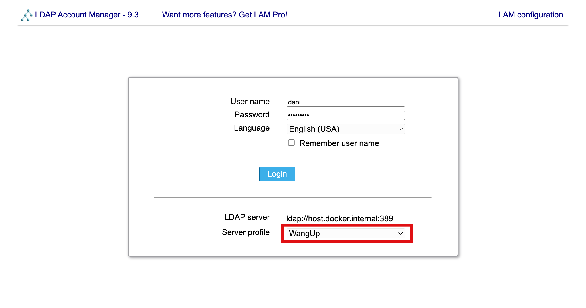
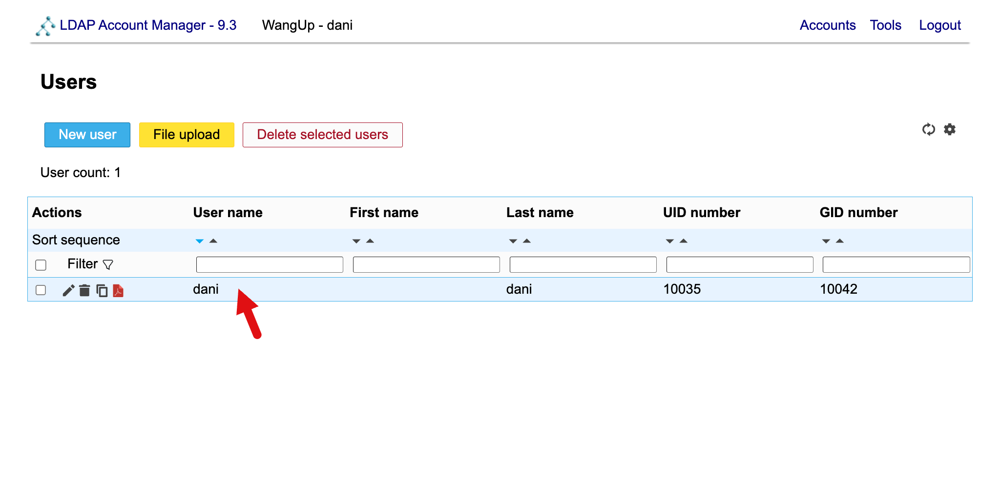
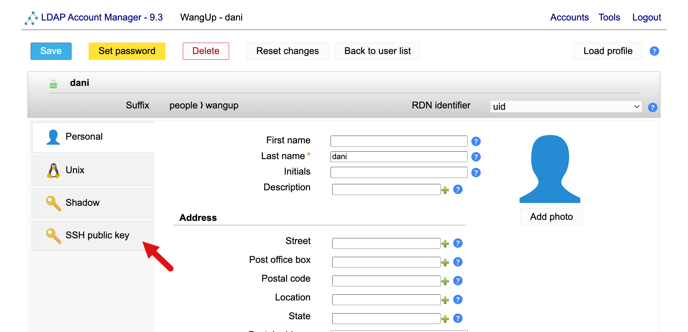
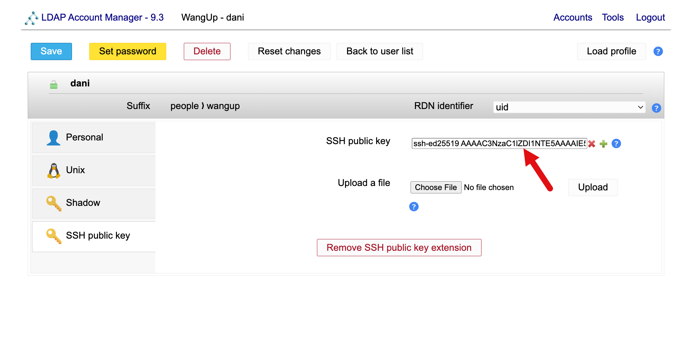
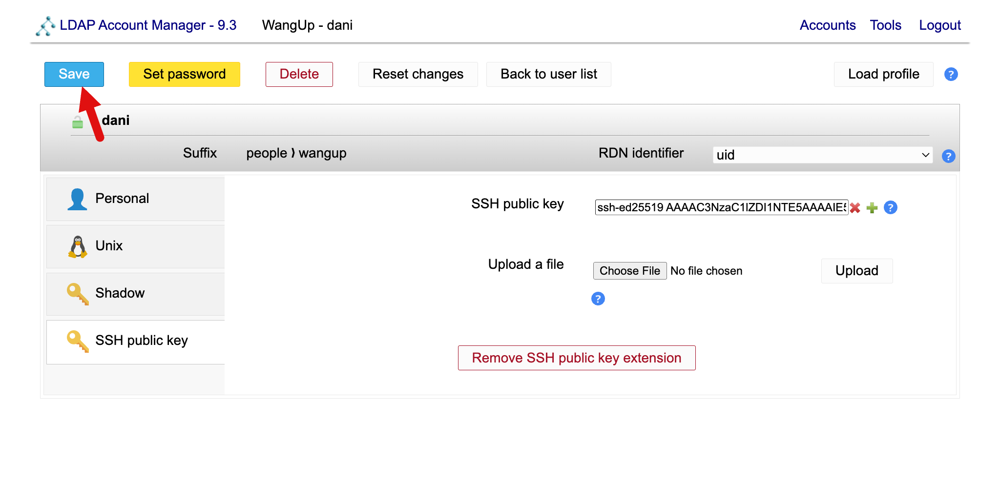
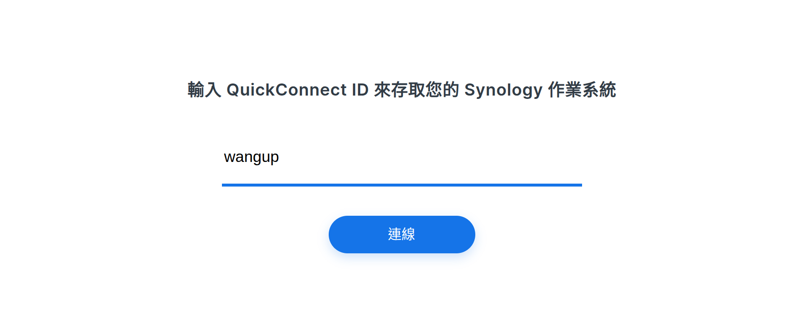
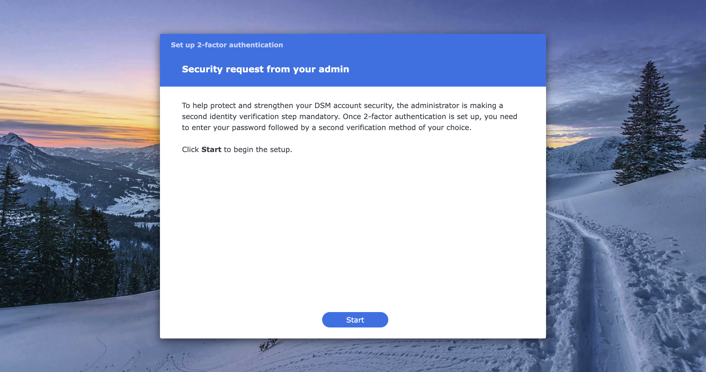
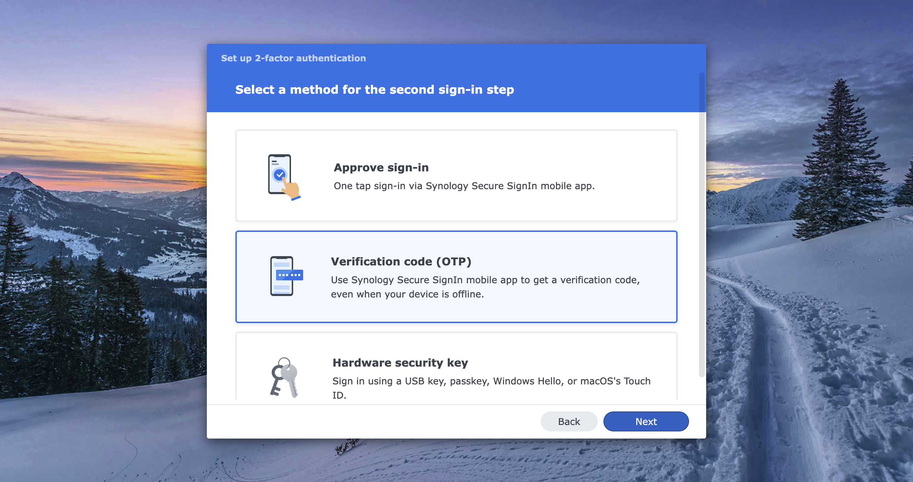
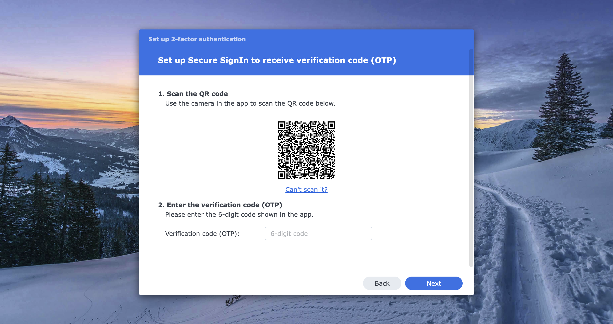
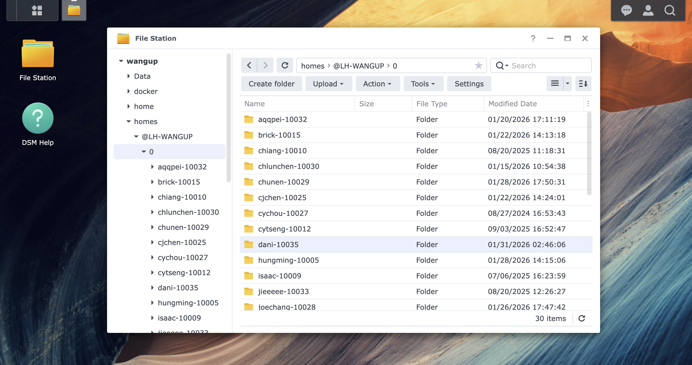

# Setting up your team account 

We provide computing resources for PoC. Follow the instructions below to gain access.

---

## Account application
Please contact admin for applying new account. You need to provide **Username** and **Password**.

## Setting up the account
We primarily remote work using [**SSH**](https://www.cloudflare.com/zh-tw/learning/access-management/what-is-ssh/).
To have full features of our server. You need to **provide your SSH key** and **login to NAS UI**.

### Generate ssh key
Execute following command to get a new pair of SSH key named `WangupServer` under `#!bash ~/.ssh` directory 
on your own personal computer. This key will be use to connect to the servers.
```bash linenums="1"
cd ~/.ssh # (1)! 
ssh-keygen -t ed25519 -f WangupServer # (2)!
```

1. `~/.ssh` is  the default directory your SSH client look for your key. But you can infact choose wherever 
you want. 
2. `ed25519` is a very modern and secure algorithm to generate ssh keys. We use `-f WangupServer` to let you 
know this key is used for WangUp Servers.

!!! note
    `ssh-keygen` will prompt you to enter **passphrase**. You can press Enter twice to skip using passphrase. Check [**This Post**](https://superuser.com/questions/261361/do-i-need-to-have-a-passphrase-for-my-ssh-rsa-key)
    for more detail

You should find two file under the `~/.ssh` directory. Which are `WangupServer.pub` and `WangupServer`.

### Upload your SSH key
Go to the [Account UI](https://account.lab.wangup.org) select the **WangUp** profile. Then login using **Username** and **Password** we just set 
in the previous section.
{ loading=lazy, align=right}

Double click your account.
{ loading=lazy, align=right}

Click the SSH public key extension
{ loading=lazy, align=right}

Paste your SSH public key here (The one file that have .pub suffix). If you want to upload another key, just click the green + button.
{ loading=lazy, align=right}

!!! note
    The SSH public key is entire content of the `~/.ssh/WangupServer.pub`. If you follow this instruction to generate ssh key.
    It will looks something like this:
    ```text
    ssh-ed25519 AAAAC3NzaC1lZDI1NTE5AAAAIGmB9Vstb4iZg9fjrz6qqysuOvr+goxtvwL1FNbwBIsW dani@ntu-caece
    ```
    Different encryption method generate keys in different length. Make sure to paste the **Entire Content** of the public key file.

Save the change. And you're done uploading the SSH public key. You can easily loggin in the server without using password.
{ loading=lazy, align=right}

### Initialize NAS storage
Our NAS require user to login atleast one time to have their directory activated.
Please visit the [**Synology Quick Connect**](https://quickconnect.to/) and enter our NAS ID `wangup` or `wangup26` and connect to it.
{ loading=lazy, align=right}

Login with the `Username` and `Password` you set.
{ loading=lazy, align=right}

Follow the instruction to setup 2-factor authentication. 
{ loading=lazy }
We recommend to use OTP authentication.
{ loading=lazy }
We recommend to use [Google Authenticator](https://play.google.com/store/apps/details?id=com.google.android.apps.authenticator2&hl=en) as the OTP app.
Please download the app and scan the QR-code. Enter the 6-digits code.
{ loading=lazy }
If you can successfully loggin. You are all set now.
{ loading=lazy }
Make sure there is **File Station** on the desktop and whether you can find your own
home directory as shown below.
{ loading=lazy }

!!! note
    This initialization need to be done on both `wangup` and `wangup26`.
---

## Login into server
On your own PC/Laptop. Open the ssh configuration file **`~/.ssh/config`** using any editor
you like (VSCode, Notepad ...). Create one if `~/.ssh/config` doesn't exist. Then add these
following config:
```apacheconf linenums="1" title="Template of ~/.ssh/config"
Host <Server-Nickman> 
  HostName <IP address> 
  User <Your-Username> 
  IdentityFile <Path-of-my-key> 
```

To add all server listed in [**Server Specs**](../infrastructures/computing/computing-specs.md).
Please refer this following content to your **`~/.ssh/config`**.
Change the **`User`** to your own username.

```apacheconf linenums="1" title="Example of ~/.ssh/config for user dani"
Host up3080 
    HostName 140.112.13.236
    User dani 
    IdentityFile ~/.ssh/WangupServer 

Host up3090 
    HostName 140.112.13.64
    User dani 
    IdentityFile ~/.ssh/WangupServer 

Host up4090 
    HostName 140.112.13.91
    User dani 
    IdentityFile ~/.ssh/WangupServer 

Host ripper
    HostName 192.168.250.100
    User dani
    IdentityFile ~/.ssh/WangupServer 
    ProxyJump up3090
```

!!! note
    ThreadRipper server doesn't have external IP. So we need to access it via any machine 
    with a external IP. You can use either `up3090` or `up4090` as proxyjump.

Before SSHing in for the first time, copy your public key to each server's `authorized_keys`.
This is required for SSH access inside containers, which cannot authenticate via LDAP.

```bash linenums="1"
ssh-copy-id -f -i ~/.ssh/WangupServer.pub up3080
ssh-copy-id -f -i ~/.ssh/WangupServer.pub up3090
ssh-copy-id -f -i ~/.ssh/WangupServer.pub up4090
ssh-copy-id -f -i ~/.ssh/WangupServer.pub ripper
```


Open terminal and ssh into servers repsectively.

=== "up3080"
    
    ```bash linenums="1" title="Example of ~/.ssh/config for user dani"
    ssh up3080
    ```

=== "up3090"

    ```bash linenums="1" title="Example of ~/.ssh/config for user dani"
    ssh up3090
    ```
=== "up4090"

    ```bash linenums="1" title="Example of ~/.ssh/config for user dani"
    ssh up4090
    ```

=== "ripper"

    ```shell linenums="1" title="Example of ~/.ssh/config for user dani"
    ssh ripper
    ```

If you can see a welcome message and a shell. You are successfully login.


Welcome onboard. Happy researshing.
