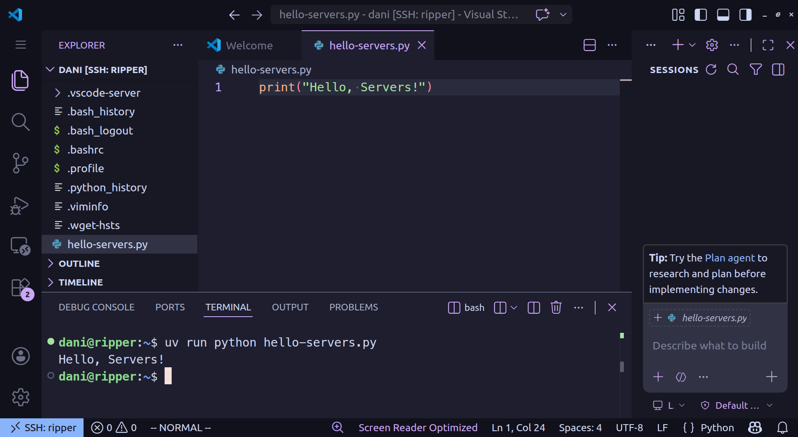
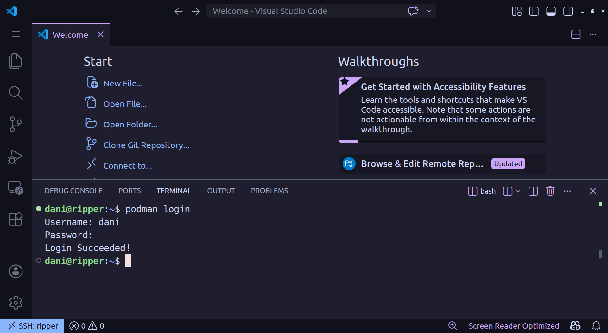
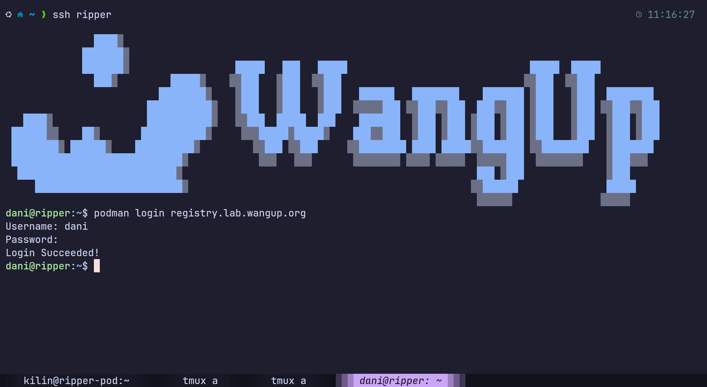
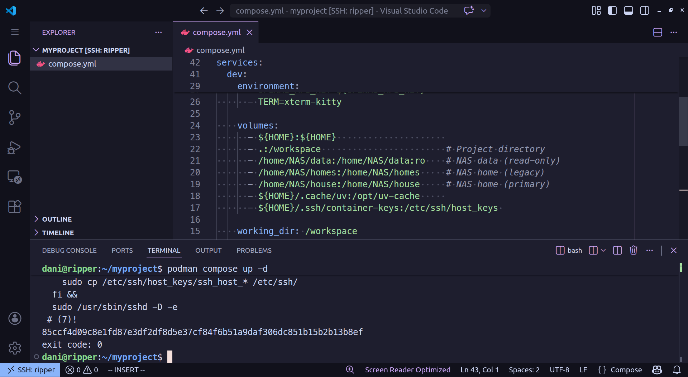
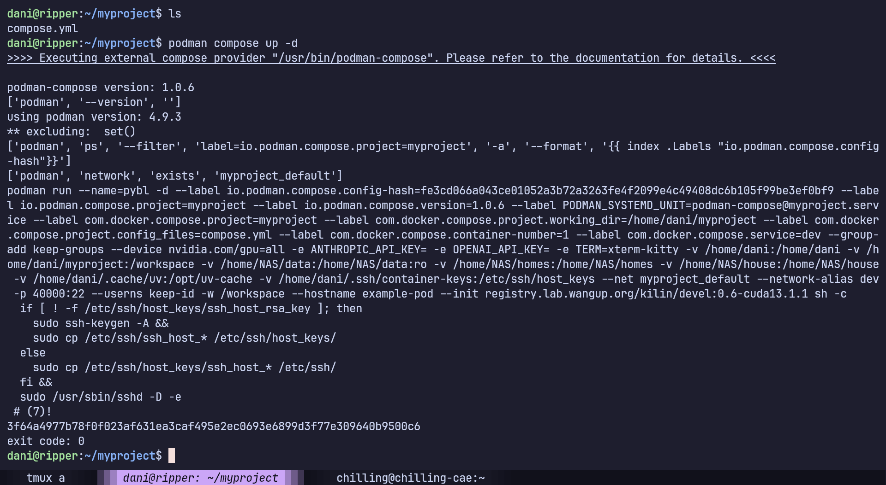
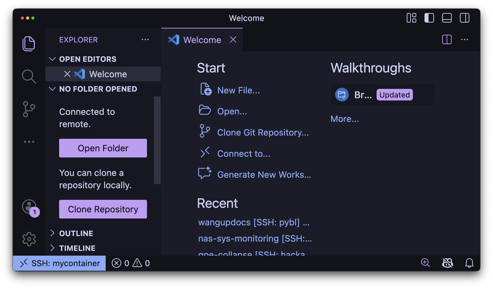
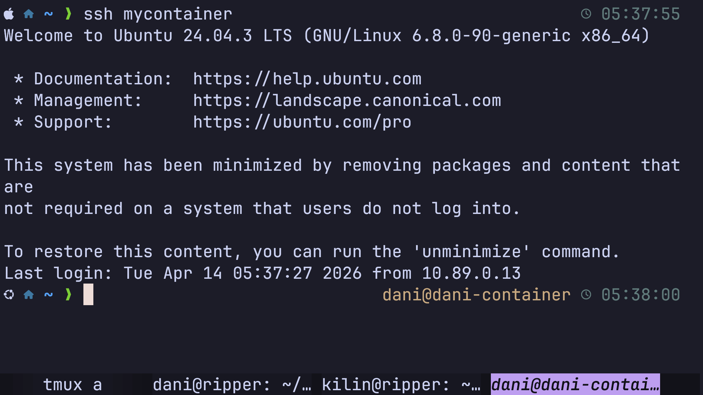
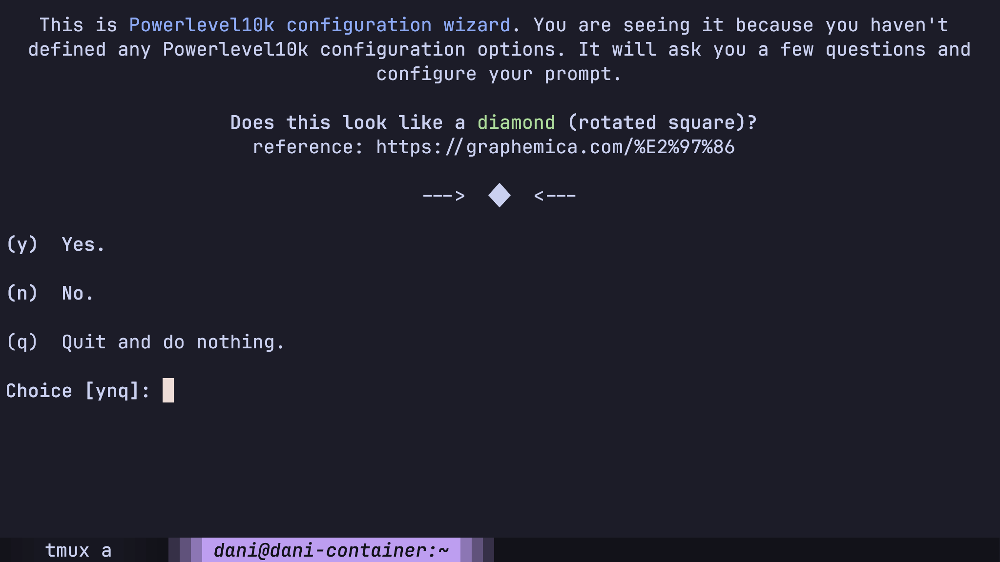

# Development

Work directly on the host via VSCode or terminal, or inside a container where you have full root access.

---

## VSCode Remote

Install the [Remote - SSH](https://marketplace.visualstudio.com/items?itemName=ms-vscode-remote.remote-ssh) extension.

Connect using the SSH config you set up in [Account Registry](account.md#login-into-server):

1. Open Command Palette (`Ctrl+Shift+P`)
2. Run **`Remote-SSH: Connect to Host`**
3. Select a server (e.g. `up4090`)
4. Open folder `/home/NAS/house/<user>` as your workspace

Done. You can start programming.



---

## Python on the Host

Use [uv](../tools.md#uv) to manage Python environments:

```bash linenums="1"
uv venv
source .venv/bin/activate
uv pip install numpy torch
```

| Use the host when | Use a container when |
|-------------------|----------------------|
| Pure Python work | Need system packages |
| Quick experiments | Specific CUDA version |
| Lightweight scripts | Reproducible environment |

---

## Containers

Containers give you full root access and an isolated environment. The lab provides a base image with CUDA, Python, and common tools pre-installed. See [Lab Images](../containers/lab-images.md) for what's available.

### 1. Login to the registry

=== "VSCode"

    Open the terminal and run:

    ```bash linenums="1"
    podman login registry.lab.wangup.org
    ```

    

=== "Terminal"

    ```bash linenums="1"
    podman login registry.lab.wangup.org
    ```

    

### 2. Create a working directory and add the compose file

```bash linenums="1"
mkdir ~/myproject && cd ~/myproject
```

The compose file below uses this configuration as an example:

| Field | Value | Description |
|-------|-------|-------------|
| Machine | `ripper` | Server you're running on — affects `hostname` and which GPU to expose |
| Image | `kilin/devel:0.6-cuda13.1.1` | Lab image to use. See [Lab Images](../containers/lab-images.md) |
| Container name | `example-container` | Your name for this container |
| Exposed port | `12345` | Host port that maps to SSH inside the container |
| Hostname | `ripper-pod` | Name the container calls itself — useful for identification in terminal |
| Working directory | `/workspace` | Directory you land in when you enter the container |

Copy the following into `compose.yml`. Edit before starting:

- **`container_name`** — must be unique among your own containers. Use something
descriptive, e.g. `yourname-dev`.

- **`ports`** — the host port (left side of `:`). Must not conflict with any 
other container on the machine. Pick any unused port in the `10000–65535` range.

!!! note "Check before you pick"
    Verify the port is free:
    ```bash
    ss -tlnp | grep :<port>
    ```
    Check your existing container names:
    ```bash
    podman ps -a
    ```

```yaml linenums="1" title="compose.yml"
services:
  dev:
    image: registry.lab.wangup.org/kilin/devel:0.6-cuda13.1.1
    container_name: example-container # (1)!
    hostname: ripper-pod
    init: true
    userns_mode: "keep-id"
    group_add:
      - keep-groups

    ports:
      - "12345:22" # (2)!

    environment:
      - ANTHROPIC_API_KEY=${ANTHROPIC_API_KEY}
      - OPENAI_API_KEY=${OPENAI_API_KEY}
      - TERM=xterm-kitty

    volumes:
      - ${HOME}:${HOME}                     # User home
      - .:/workspace                        # Project directory
      - /home/NAS/data:/home/NAS/data:ro    # NAS data
      - /home/NAS/homes:/home/NAS/homes     # NAS home
      - /home/NAS/house:/home/NAS/house     # Big NAS home
      - ${HOME}/.cache/uv:/opt/uv-cache     # UV cache
      - ${HOME}/.ssh/container-keys:/etc/ssh/host_keys

    working_dir: /workspace

    command: >
      sh -c "
        if [ ! -f /etc/ssh/host_keys/ssh_host_rsa_key ]; then
          sudo ssh-keygen -A &&
          sudo cp /etc/ssh/ssh_host_* /etc/ssh/host_keys/
        else
          sudo cp /etc/ssh/host_keys/ssh_host_* /etc/ssh/
        fi &&
        sudo /usr/sbin/sshd -D -e
      "
    devices:
      - nvidia.com/gpu=all
```

1. Must be unique among your own containers. Use something descriptive, e.g. `yourname-dev`.
2. The host port (left side of `:`). Must not conflict with any other container 
on the machine. Pick any unused port in the `10000–65535` range.
### 3. Start the container

In `~/myproject`, execute following command to start the container.

```bash
podman compose up -d
```

=== "VSCode"
    

=== "Terminal"
    

Each line in the output is a service starting up. `exit code: 0` means the container started successfully. Verify it's running:

```bash linenums="1"
podman ps
```

You should see `example-container` listed with status `Up`. If it's missing, check the logs:

```bash linenums="1"
podman logs example-container
```

### 4. Add SSH config entry on your local machine

Open `~/.ssh/config` on your **local machine** and add an entry for the container. Using the configuration from this example — container on `ripper` (internal IP `192.168.250.100`), port `12345`, user `dani`:

```apacheconf linenums="1"
Host mycontainer 
    HostName 192.168.250.100
    Port 12345
    User dani
    IdentityFile ~/.ssh/WangupServer
    ProxyJump up3090
```

- **`Host`** — alias used in `ssh mycontainer` and VSCode Remote-SSH.
- **`HostName`** — `ripper`'s internal IP. See [Network Topology](../../infrastructures/computing-specs.md#network-topology) for all server IPs.
- **`Port`** — matches the exposed port in `compose.yml`.
- **`ProxyJump`** — `ripper` has no public IP. Traffic is tunneled through `up3090` (or `up3080`) to reach the internal network. `up3090` must already be in your SSH config.

### 5. Connect

=== "VSCode"

    Open Command Palette (`Ctrl+Shift+P`) → **`Remote-SSH: Connect to Host`** → select `mycontainer`.

    

=== "Terminal"

    ```bash linenums="1"
    ssh mycontainer
    ```

    

!!! note "First login with `kilin/devel` — Powerlevel10k prompt"
    The Powerlevel10k wizard will appear on first login. Follow the prompts to configure your terminal style. Run `p10k configure` to redo it later.
    

---

You're all set. Your container is running and you can start working.

For more on managing containers — running multiple containers, building your own image, or pushing to the registry — see [Using Podman](../containers/podman.md).
