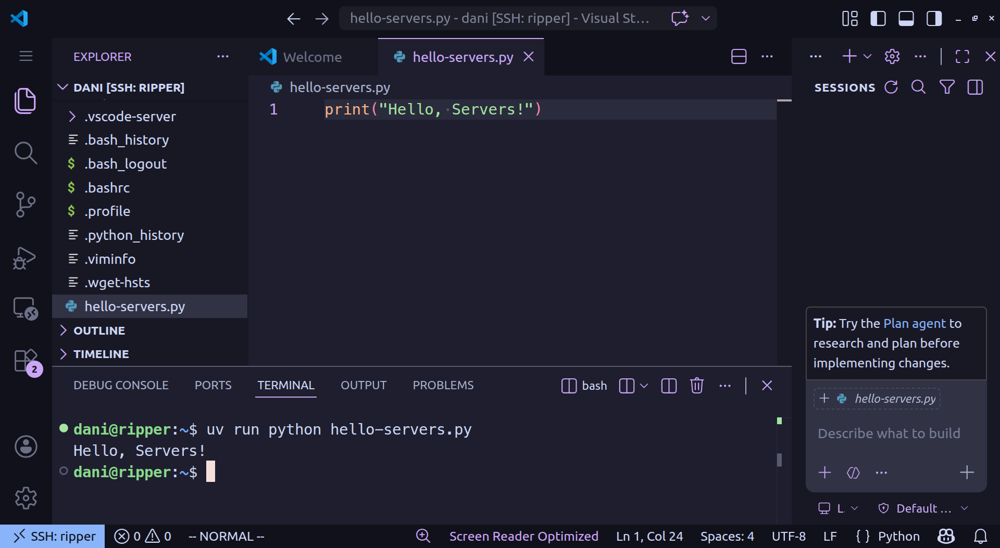
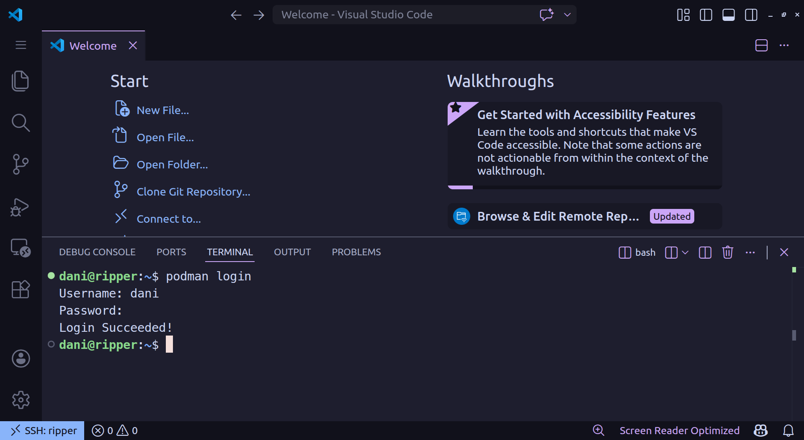
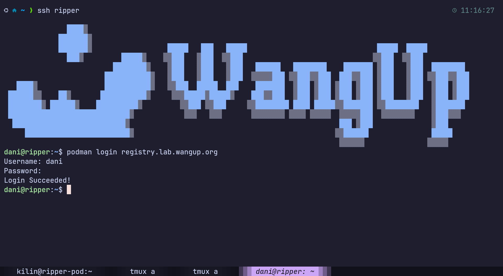
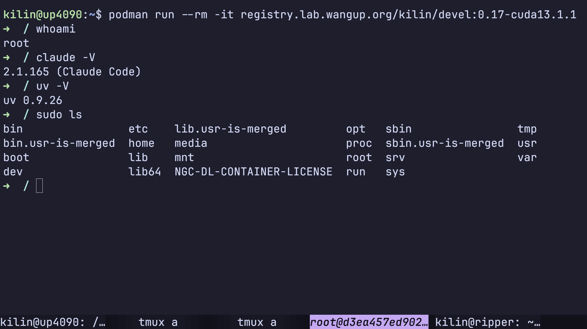
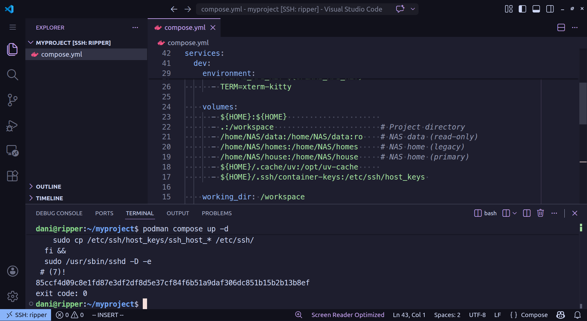
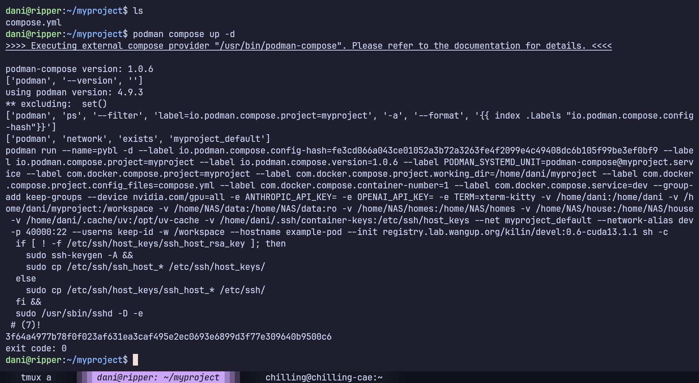
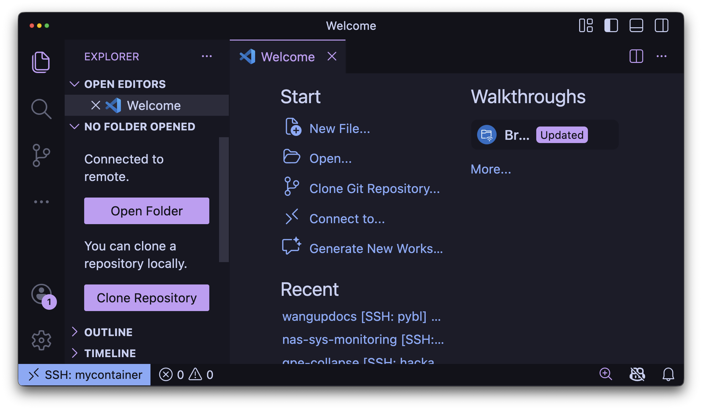
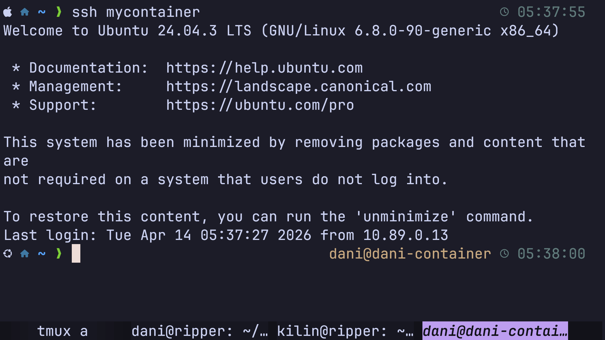
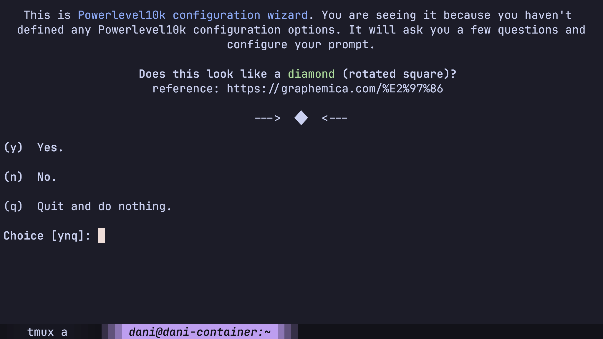

# Development

Develop inside a container — full root, a reproducible environment, and the same setup on every machine. Connect to a server with VSCode or a terminal, then start your container.

---

## Set up your workspace

Keep your work on NAS, not in local home — see [Where Your Files Live](environment.md#where-your-files-live). Symlink your NAS directories into your home so paths are short and identical on every server.

Local home is per-machine, so run this the first time you log in to each server:

```bash linenums="1"
mkdir -p /home/NAS/house/$USER/projects
ln -s /home/NAS/house/$USER/projects ~/projects
ln -s /home/NAS/data ~/datasets
```

---

## VSCode Remote

Install the [Remote - SSH](https://marketplace.visualstudio.com/items?itemName=ms-vscode-remote.remote-ssh) extension.

Connect using the SSH config you set up in [Account Registry](account.md#login-into-server):

1. Open Command Palette (`Ctrl+Shift+P`)
2. Run **`Remote-SSH: Connect to Host`**
3. Select a server (e.g. `ripper`)
4. Open your project directory as your workspace

Done. You can start programming.



---

## Containers

Containers give you full root access and an isolated environment. The lab provides a base image with CUDA, Python, and common tools pre-installed. See [Lab Images](../containers/lab-images.md) for what's available.

### 1. Log in to the registry

=== "VSCode"

    Open the terminal and run:

    ```bash linenums="1"
    podman login registry.lab.wangup.org
    ```

    

=== "Terminal"

    ```bash linenums="1"
    podman login registry.lab.wangup.org
    ```

    

#### Try the image

Run the base image directly to look around:

```bash linenums="1"
podman run --rm -it registry.lab.wangup.org/kilin/devel:0.13-cuda13.1.1
```

You land as `root` inside the container, with CUDA, Python, and the lab tools ready. Do whatever you want — it's fully isolated from the host. Type `exit` to leave; `--rm` then deletes the container, so nothing you did persists.



This is fine for a quick look, not for real work: no project files, no saved changes, no SSH access. For that, define your container in a compose file — the rest of this section walks through it.

### 3. Create a working directory and add the compose file

`~/projects` is the symlink to `/home/NAS/house/$USER/projects` you set up in [Set up your workspace](#set-up-your-workspace), so the project lives on NAS.

```bash linenums="1"
mkdir ~/projects/myproject && cd ~/projects/myproject
```

The compose file below uses this configuration as an example:

| Field | Value | Description |
|-------|-------|-------------|
| Machine | `ripper` | Server you're running on — affects `hostname` and which GPU to expose |
| Image | `kilin/devel:0.13-cuda13.1.1` | Lab image to use. See [Lab Images](../containers/lab-images.md) |
| Container name | `example-container` | Your name for this container |
| Exposed port | `12345` | Host port that maps to SSH inside the container |
| Hostname | `ripper-pod` | Name the container calls itself — useful for identification in terminal |
| Working directory | `/workspace` | Directory you land in when you enter the container |


Copy the following into `compose.yml`. Edit before starting:

- **`container_name`** — must be unique among your own containers. Use something
descriptive, e.g. `yourname-dev`.

- **`ports`** — the host port (left side of `:`). Must not conflict with any 
other container on the machine. Pick any unused port in the `10000–65535` range.

!!! note "Check before you pick"
    1. Verify the port is free:
    ```bash
    ss -tlnp | grep :<port>
    ```
    If this command output nothing. The port is free. 
      
    2. Check your existing container names:
    ```bash
    podman ps -a
    ```

--8<-- "snippets/compose-dev.md"
### 4. Start the container

!!! note
    Unlike Docker, Podman is daemonless and relies on [systemd](https://docs.oracle.com/en/learn/ol-podman-lingering/index.html) to manage container lifecycle.

Enable linger so your containers keep running after you log out.

```bash linenums="1"
loginctl enable-linger $USER
```

In your project directory, execute the following command to start the container.

```bash linenums="1"
podman compose up -d
```

=== "VSCode"
    

=== "Terminal"
    

Each line in the output is a service starting up. `exit code: 0` means the container started successfully. Verify it's running:

```bash linenums="1"
podman ps
```

You should see `example-container` listed with status `Up`. If it's missing, check the logs:

```bash linenums="1"
podman logs example-container
```

### 5. Add SSH config entry on your local machine

Open `~/.ssh/config` on your **local machine** and add an entry for the container. Using the configuration from this example — container on `ripper` (internal IP `192.168.250.100`), port `12345`, user `dani`:

```apacheconf linenums="1"
Host mycontainer 
    HostName 192.168.250.100
    Port 12345
    User dani
    IdentityFile ~/.ssh/WangupServer
    ProxyJump up3090
```

- **`Host`** — alias used in `ssh mycontainer` and VSCode Remote-SSH.
- **`HostName`** — `ripper`'s internal IP. See [Network Topology](../../infrastructures/computing-specs.md#network-topology) for all server IPs.
- **`Port`** — matches the exposed port in `compose.yml`.
- **`ProxyJump`** — `ripper` has no public IP. Traffic is tunneled through `up3090` (or `up3080`) to reach the internal network. `up3090` must already be in your SSH config.

### 4. Connect

=== "VSCode"

    Open Command Palette (`Ctrl+Shift+P`) → **`Remote-SSH: Connect to Host`** → select `mycontainer`.

    

=== "Terminal"

    ```bash linenums="1"
    ssh mycontainer
    ```

    

!!! note "First login with `kilin/devel` — Powerlevel10k prompt"
    The Powerlevel10k wizard will appear on first login. Follow the prompts to configure your terminal style. Run `p10k configure` to redo it later.
    

---

You're all set. Your container is running and you can start working.

For the full reference on running, interacting with, and managing containers, see [Using Podman](../containers/use-podman.md).
