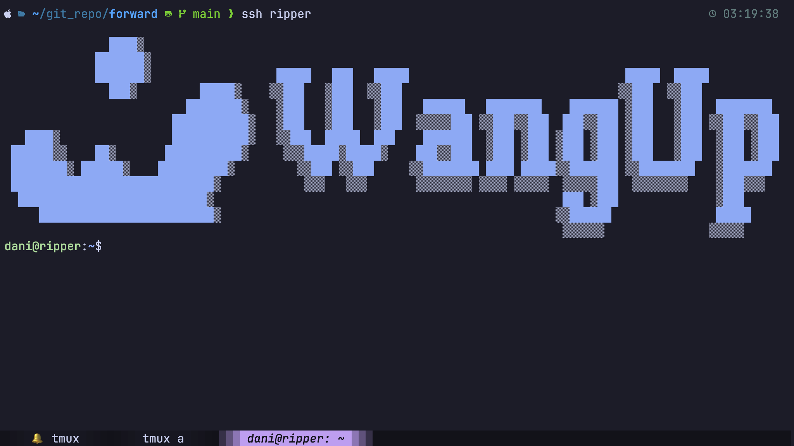

# Understanding Your Environment

You're on a **remote Linux server**. Your commands run on the server — your laptop is just an interface.



No Linux experience? Start with the [MDN Command Line Crash Course](https://developer.mozilla.org/en-US/docs/Learn_web_development/Getting_started/Environment_setup/Command_line).

---

## What's Available

Pre-installed on all servers:

| Tool | Purpose |
|------|---------|
| `python3` | Python 3.12 |
| `uv` | Python package manager |
| `git` | Version control |
| `tmux` | Terminal multiplexer |
| `nvtop` / `nvidia-smi` | GPU monitoring |
| `htop` | CPU & RAM monitoring |
| `ncdu` | Disk usage |

See [Tools](../tools.md) for usage.

---

## No Root Access

You cannot use `sudo`. This means no `apt install` or system-wide changes.

For Python packages, use `uv` or `conda`. For anything that requires system-level dependencies, use a container or build from source. See [Development](development.md).

---

## Keep Jobs Alive with tmux

SSH sessions end when you close your terminal or lose connection — and any running process dies with it.

Use [tmux](../tools.md#tmux) for any job that takes more than a few minutes:

```bash linenums="1"
tmux new -s work        # Start session
# ... run your job ...
# Ctrl+B D to detach
tmux attach -t work     # Reconnect later
```

---

## GPUs

Only some servers have GPUs. They are for proof-of-concept work — not large-scale training. For serious compute, use [NCHC HPC](../../hpc/overview.md).

Check what's available before starting a job:

```bash linenums="1"
nvtop                   # Interactive view (recommended)
nvidia-smi              # Snapshot
```

To target a specific GPU:

```bash linenums="1"
CUDA_VISIBLE_DEVICES=0 python3 train.py
```
