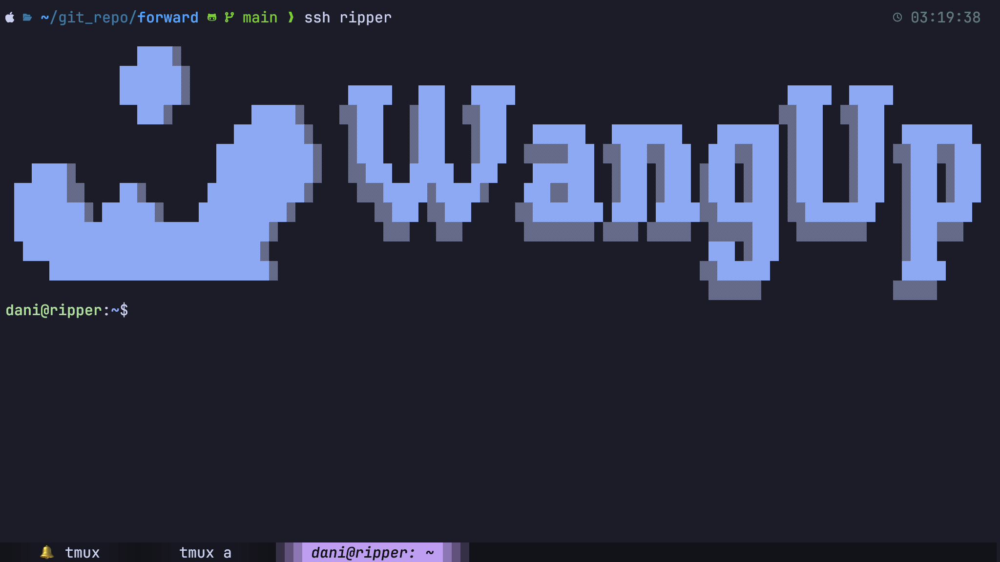

# Understanding Your Environment

You're on a **remote Linux server**. Your commands run on the server — your laptop is just an interface.



No Linux experience? Start with the [MDN Command Line Crash Course](https://developer.mozilla.org/en-US/docs/Learn_web_development/Getting_started/Environment_setup/Command_line).

The servers come with a standard toolset pre-installed — Python 3.12, `uv`, `git`, `tmux`, and GPU/CPU/disk monitors. See [Tools](../tools.md) for usage.

---

## No Root Access

You cannot use `sudo`. No `apt install`, no system-wide changes.

For Python packages, use `uv` or `pip`. For anything that needs system-level dependencies, use a container — where you have full root. See [Development](development.md).

---

## Sessions Are Ephemeral

SSH sessions end when you close your terminal or lose connection — and any process running in them dies too.

Use `tmux` for any job longer than a few minutes: start it inside a tmux session, detach, and reconnect later. See [tmux](../tools.md#tmux).

---

## Shared Machines

Several people are logged in to the same server at once. CPU, RAM, local disk, and GPUs are all shared — one careless job slows everyone down.

- Check load before heavy work — `htop` for CPU and RAM, `nvtop` for GPUs.
- Don't claim more GPUs than you need.
- Don't fill local disk — it's limited and shared. Keep large files on NAS.
- Clean up stray processes and temp files when you finish.

---

## GPUs

Only some servers have GPUs, and they're for proof-of-concept work — not large-scale training. For serious compute, use [NCHC HPC](../../hpc/overview.md).

GPUs are shared. Check usage with [nvtop](../tools.md#nvtop) before starting a job. Target a specific GPU with `CUDA_VISIBLE_DEVICES`:

```bash linenums="1"
CUDA_VISIBLE_DEVICES=0 python3 train.py
```

---

## Where Your Files Live

Two Synology NAS units are mounted via NFS on every server, plus a local disk on each machine.

| Path | Storage | Capacity | Purpose |
|------|---------|----------|---------|
| `/home/NAS/house/<user>` | DS1823xs+ (wangup26) | 35 TB | Primary home |
| `/home/NAS/data` | DS923+ (wangup) | 83.7 TB | Shared datasets (read-only) |
| `/home/NAS/homes/<user>` | DS923+ (wangup) | 83.7 TB | Legacy home (being phased out) |
| `/home/<user>` | Local SSD | ~1.5 TB | Per-machine, disposable |

!!! warning 
    Your NAS homes must be initialized before first use — see [Account Registry](account.md#initialize-nas-storage).

### Keep projects on NAS

Put your project files — including the whole repository — under `/home/NAS/house/<user>`. It's shared across every server, so you work on the same files from any machine without copying. NAS storage is **not** a backup, though — keep code in git. See [Storage Overview](../storage/overview.md#data-safety).

### Local home is disposable

`/home/<user>` is local to one machine — you get a *different* home on each server, and none are shared or backed up. Your NAS directories, by contrast, are identical on every machine. Treat local home as disposable. Keep only:

- Dotfiles and shell config
- User-installed software
- Symlinks pointing into your NAS directories

Set up those symlinks in [Development](development.md#set-up-your-workspace) so `~/projects` and `~/datasets` resolve to NAS on every machine.

### Container environments stay fast

A NAS-hosted Python environment is slow — thousands of small package files over NFS make every `import` crawl. The lab container images avoid this: they install the Python environment at `/opt/venv` on the host's local disk, not on NAS. Your code lives on NAS; the environment runs on fast local storage. You get both without doing anything. See [Building Images](../containers/building.md).

---

For storage commands, quotas, and troubleshooting, see [Storage Overview](../storage/overview.md).
