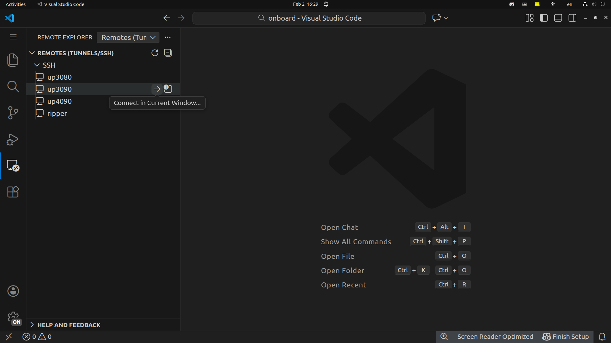

# Running Your First Program

A guide to run programs on lab servers.

---

## Connect to server using VSCode

On VSCode/Cursor/Antigravity, install the remote ssh extension. Here we use VSCode as example.

Go to **`Remote Explorer`** in the activity bar on the left. Select any of the server you like.
And click the **`Connect in Current Window`**

You can then open a new directory on `/home/NAS/homes/<Your Username>`
!!! Note
    NAS is the best place to store your project. For more information, please
    refer to [**Data Storage**](../data-storage.md)

Now you can use VSCode just like it's on your own PC except all the computation
runs on the remote server. 

Let's create a file `hello-ssh.py` that can show some system information.
```python linenums="1" title="hello-ssh.py"
import os
import socket
import platform
import getpass

hostname = socket.gethostname()

# Get actual network IP (not 127.0.0.1)
s = socket.socket(socket.AF_INET, socket.SOCK_DGRAM)
s.connect(("8.8.8.8", 80))
ip_address = s.getsockname()[0]
s.close()

print("=" * 50)
print("SERVER INFORMATION")
print("=" * 50)
print(f"Username:        {getpass.getuser()}")
print(f"Hostname:        {hostname}({ip_address})")
print(f"Current Dir:     {os.getcwd()}")
print(f"Home Dir:        {os.path.expanduser('~')}")
print(f"OS:              {platform.system()} {platform.release()}")
print(f"CPU Count:       {os.cpu_count()}")
print(f"Python Version:  {platform.python_version()}")
print("=" * 50)
```

Run the program in VSCode terminal:
```bash linenums="1"
python3 hello-ssh.py
```

Example output for user dani on up4090:


---

## File Storage

Your files are stored in two locations:

| Location | Path | Purpose | Persistent |
|----------|------|---------|------------|
| Home | `/home/NAS/homes/<username>` | Code, datasets, models | Yes |
| Local | `/home/<username>` | Temporary files, cache | No |

**Important:** Use `/home/NAS/homes/<username>` for all important work. Files in `/home/<username>` are not backed up.

Check your storage:
```bash linenums="1"
cd /home/NAS/homes/<username>
pwd  # Verify you're in the right directory
```

Example output for user dani:
```text linenums="1"
/home/NAS/homes/dani-10035
```
---

## Next Steps

- Check [Computing Specs](../infrastructures/computing/computing-specs.md) to choose the right server
- For large-scale training, see [HPC Tutorial](../hpc/overview.md)
- Store datasets in `/home/NAS/Data/` (shared storage)
