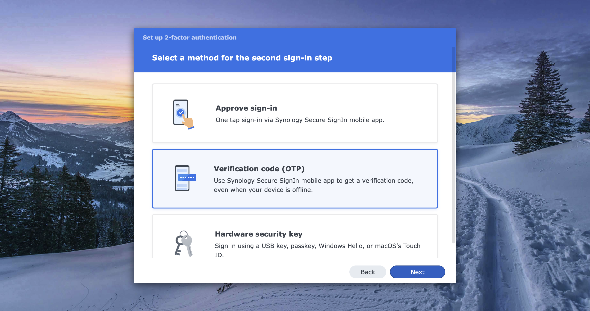
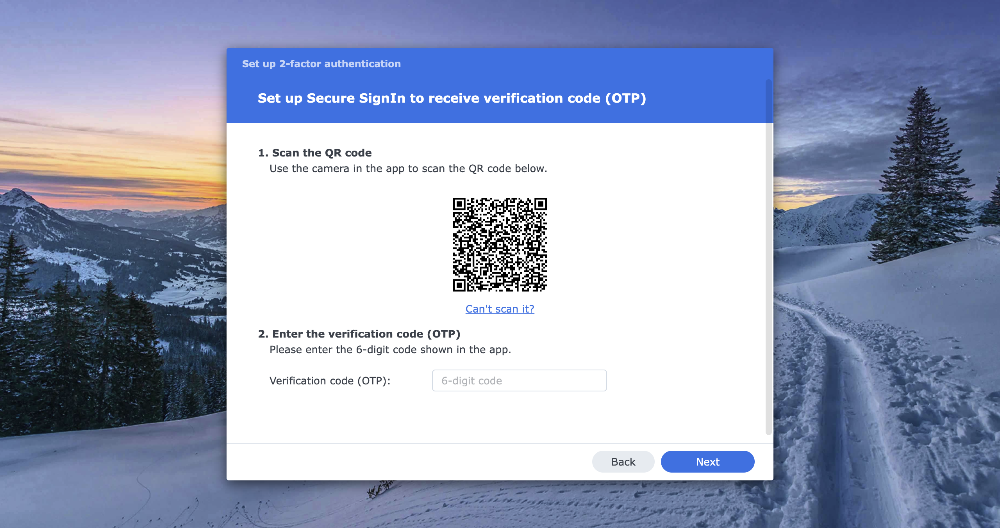

# Setting up your team account 

We provide computing resources for PoC. Follow the instructions below to gain access.

---

## Account application
Please contact admin for applying new account. You need to provide **Username** and **Password**.

## Setting up the account
We primarily remote work using [**SSH**](https://www.cloudflare.com/zh-tw/learning/access-management/what-is-ssh/).
To have full features of our server. You need to **provide your SSH key** and **login to NAS UI**.

### Generate ssh key
Execute following command to get a new pair of SSH key named `WangupServer` under `#!bash ~/.ssh` directory 
on your own personal computer. This key will be use to connect to the servers.
```bash linenums="1"
cd ~/.ssh # (1)! 
ssh-keygen -t ed25519 -f WangupServer # (2)!
```

1. `~/.ssh` is  the default directory your SSH client look for your key. But you can infact choose wherever 
you want. 
2. `ed25519` is a very modern and secure algorithm to generate ssh keys. We use `-f WangupServer` to let you 
know this key is used for WangUp Servers.

!!! note
    `ssh-keygen` will prompt you to enter **passphrase**. You can press Enter twice to skip using passphrase. Check [**This Post**](https://superuser.com/questions/261361/do-i-need-to-have-a-passphrase-for-my-ssh-rsa-key)
    for more detail

You should find two file under the `~/.ssh` directory. Which are `WangupServer.pub` and `WangupServer`.

### Upload your SSH key
Login to the [Account UI](https://account.lab.wangup.org) using **Username** and **Password** we just set 
in the previous section.


### Initialize NAS storage
Our NAS require user to login atleast one time to have their directory activated.
Please visit our [**NAS Web UI**](https://wangup.synology.me:6110) and login with the
`Username` and `Password` you set.

{ loading=lazy, align=right}

Follow the instruction to setup 2-factor authentication. 
{ loading=lazy }
We recommend to use OTP authentication.
{ loading=lazy }
We recommend to use [Google Authenticator](https://play.google.com/store/apps/details?id=com.google.android.apps.authenticator2&hl=en) as the OTP app.
Please download the app and scan the QR-code. Enter the 6-digits code.
{ loading=lazy }
If you can successfully loggin. You are all set now.
{ loading=lazy }
Make sure there is **File Station** on the desktop and whether you can find your own
home directory as shown below.
{ loading=lazy }

---

## Login into server
On your own PC/Laptop. Open the ssh configuration file **`~/.ssh/config`** using any editor
you like (VSCode, Notepad ...). Create one if `~/.ssh/config` doesn't exist. Then add these
following config:
```apacheconf linenums="1" title="Template of ~/.ssh/config"
Host <Server-Nickman> 
  HostName <IP address> 
  User <Your-Username> 
  IdentityFile <Path-of-my-key> 
```

To add all server listed in [**Server Specs**](../infrastructures/computing/computing-specs.md).
Please refer this following content to your **`~/.ssh/config`**.
Change the **`User`** to your own username.

```apacheconf linenums="1" title="Example of ~/.ssh/config for user dani"
Host up3080 
    HostName 140.112.13.236
    User dani 
    IdentityFile WangupServer 

Host up3090 
    HostName 140.112.13.64
    User dani 
    IdentityFile WangupServer 

Host up4090 
    HostName 140.112.13.91
    User dani 
    IdentityFile WangupServer 

Host ripper
    HostName 192.168.250.100
    User dani
    IdentityFile WangupServer
    ProxyJump up3090
```

!!! note
    ThreadRipper server doesn't have external IP. So we need to access it via any machine 
    with a external IP. You can use either `up3090` or `up4090` as proxyjump.

Open terminal and ssh into servers repsectively.

=== "up3080"
    
    ```bash linenums="1" title="Example of ~/.ssh/config for user dani"
    ssh up3080
    ```

=== "up3090"

    ```bash linenums="1" title="Example of ~/.ssh/config for user dani"
    ssh up3090
    ```
=== "up4090"

    ```bash linenums="1" title="Example of ~/.ssh/config for user dani"
    ssh up4090
    ```

=== "ripper"

    ```shell linenums="1" title="Example of ~/.ssh/config for user dani"
    ssh ripper
    ```

If you can see a welcome message and a shell. You are successfully login.


Welcome onboard. Happy researshing.
