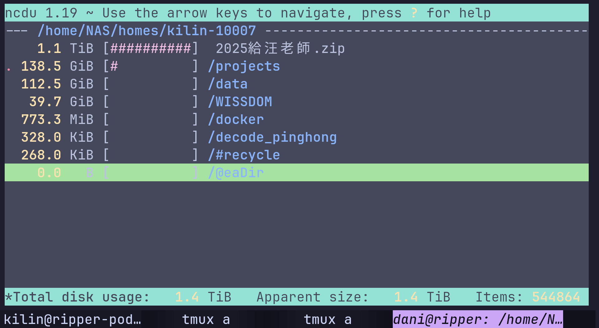
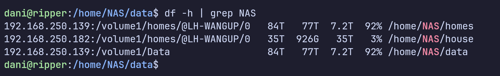

# Storage

Two NAS systems are mounted via NFS on all servers.

| Path | NAS | Capacity | Purpose |
|------|-----|----------|---------|
| `/home/NAS/house/<user>` | DS1823xs+ | 35TB | Your primary home |
| `/home/NAS/data` | DS923+ | 83.7TB | Shared datasets |
| `/home/NAS/homes/<user>` | DS923+ | 83.7TB | Legacy home (being phased out) |

!!! note
    Your home directories must be initialized before first use. This is done during account setup — see [Account Registry](account.md#initialize-nas-storage).

---

## Working with Storage

### Check disk usage

```bash linenums="1"
ncdu /home/NAS/house/$USER     # Interactive usage breakdown
```


```bash linenums="1"
df -h | grep NAS               # NAS mount sizes
```


### Copy files

NAS is mounted as a regular directory — use `cp` as normal.

```bash linenums="1"
cp -r /home/NAS/data/dataset ./dataset          # Copy dataset to local
cp -r ./results /home/NAS/house/$USER/results   # Save results to NAS
```

!!! note
    For very large transfers, use `rsync -av` instead of `cp` — it can resume if interrupted.

### Check mount points

```bash linenums="1"
mount | grep NAS
```

---

## Local Storage

Each server has local disk at `/home/<user>`. Faster than NAS but not shared and not backed up.

| | NAS | Local |
|-|-----|-------|
| Shared across servers | Yes | No |
| Backed up | Yes | No |
| Speed | ~600MB/s | Fast |

Store code and results on NAS. Use local for temporary files or active training data.

---

For quota management and transfer tips, see [NAS Storage](../storage/nas.md).
