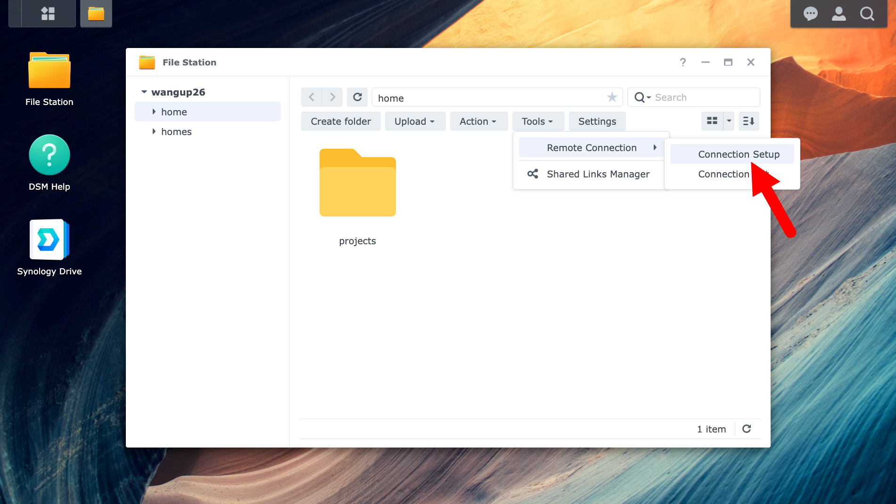

# Synology Web UI

A browser-based interface for managing files and account settings without SSH.

**DS923+** (data): [wangup.synology.me](https://wangup.synology.me) or [QuickConnect](https://quickconnect.to/wangup)

**DS1823xs+** (primary home): [QuickConnect](https://quickconnect.to/wangup26)

Login with your lab username and password.

---

## File Station

Browse, manage, and transfer files through the browser.

**Download files to your local machine** — right-click any file or folder → **`Download`**. Useful for pulling results without setting up `scp`.

**Upload files** — drag and drop into File Station, or use the **`Upload`** button.

**Preview** — images, PDFs, and videos can be previewed directly in the browser without downloading.

**Share files** — right-click a file → **`Share`** → create a temporary download link. Send this to collaborators outside the lab without giving them server access.

---

## Personal Settings

Click your username (top right) → **`Personal`**:

- **Change password** — All password are managed by our [LDAP server](https://account.lab.wangup.org)
- **2-Factor Authentication** — manage your OTP settings (enable, disable, re-enroll)

---

## Specific Features

### Remote Drives (Google, OneDrive, DropBox)

Visit **File Station** -> **Tools** -> **Remote Connection** -> **Connection Setup**.
And follow the instruction from the WebUI.

