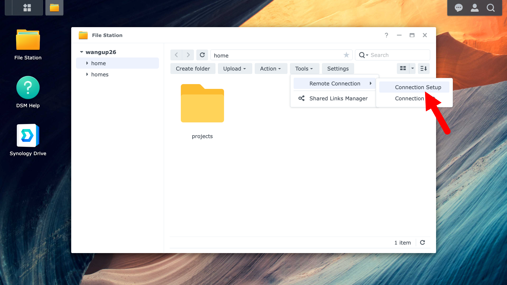

# Synology Web UI

Browser access to the NAS — the same files you see at `/home/NAS/...`, without SSH. Use it for quick browsing, previewing files, sharing with outside collaborators, and managing your account. For bulk transfers use [rsync/scp](transfer.md) instead — the Web UI runs over HTTPS and can't resume.

**Which NAS:**

| NAS | Holds | Login |
|-----|-------|-------|
| wangup26 (DS1823xs+) | Your home (`/home/NAS/house`) | [QuickConnect](https://quickconnect.to/wangup26) |
| wangup (DS923+) | Shared data, legacy homes | [wangup.synology.me](https://wangup.synology.me) · [QuickConnect](https://quickconnect.to/wangup) |

Login with your lab username and password.

---

## File Station

Browse, manage, and transfer files through the browser.

- **Download** — right-click any file or folder → **`Download`**.
- **Upload** — drag and drop, or the **`Upload`** button.
- **Preview** — images, PDFs, and videos open directly in the browser.
- **Share with outsiders** — right-click → **`Share`** → create a temporary download link. Send it to collaborators who have no server account. This is the one thing the CLI can't do.

---

## Personal Settings

Click your username (top right) → **`Personal`**:

- **Change password** — all passwords are managed by the [LDAP server](https://account.lab.wangup.org).
- **2-Factor Authentication** — manage your OTP settings (enable, disable, re-enroll).

---

## Remote Drives (Google, OneDrive, Dropbox)

Mount an external cloud drive into File Station: **File Station** → **Tools** → **Remote Connection** → **Connection Setup**, then follow the prompts.

